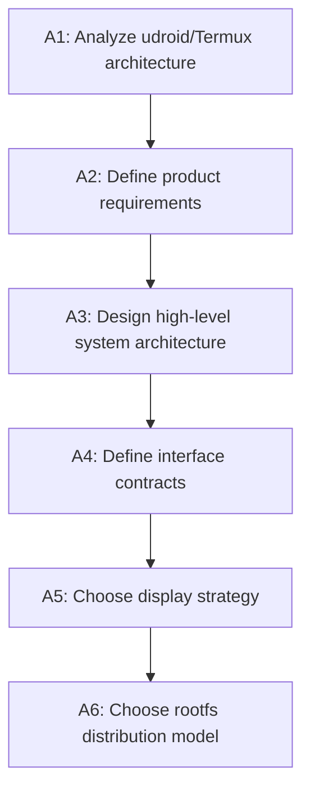
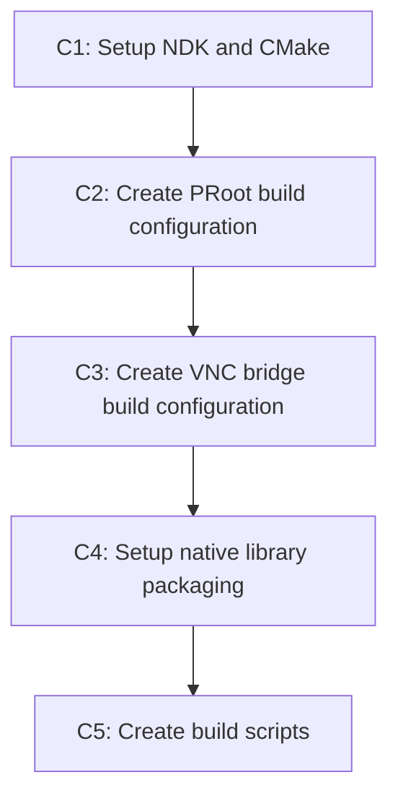
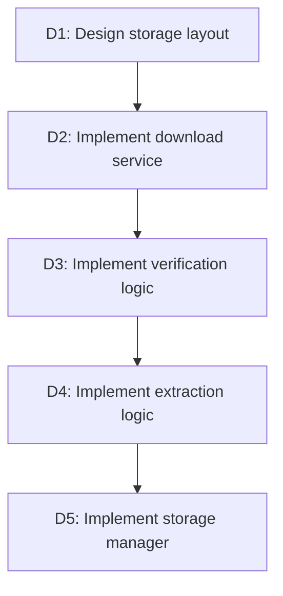
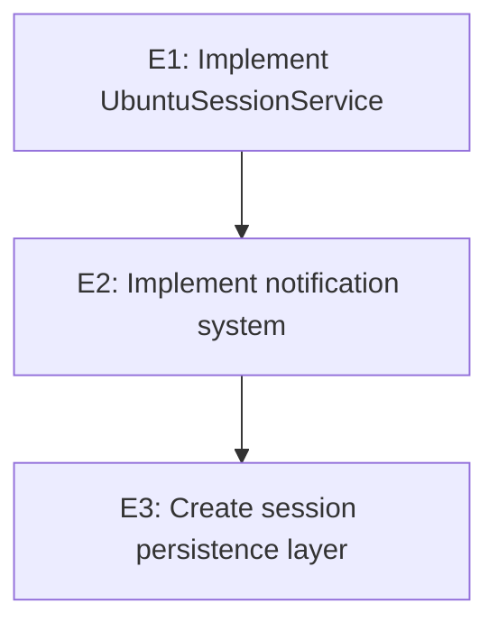
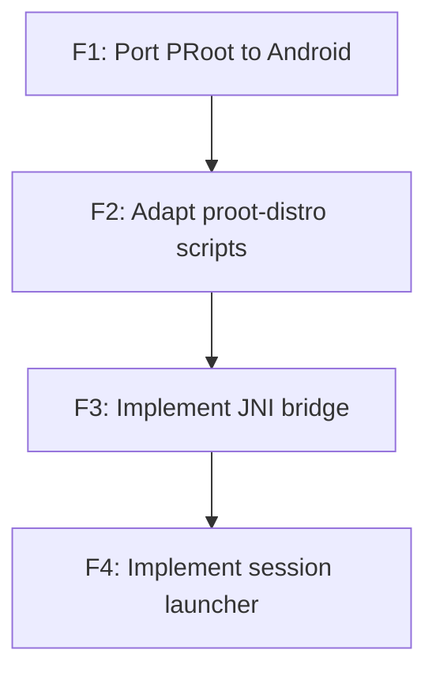
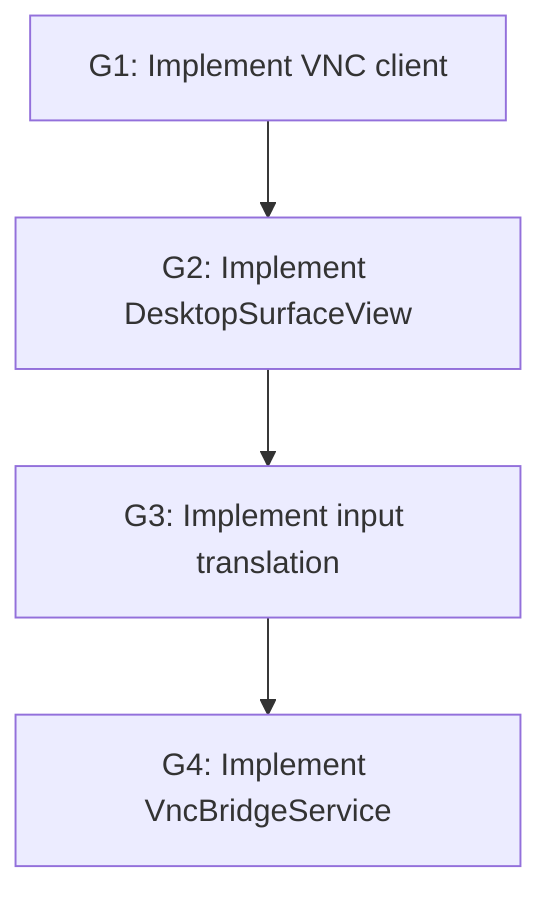
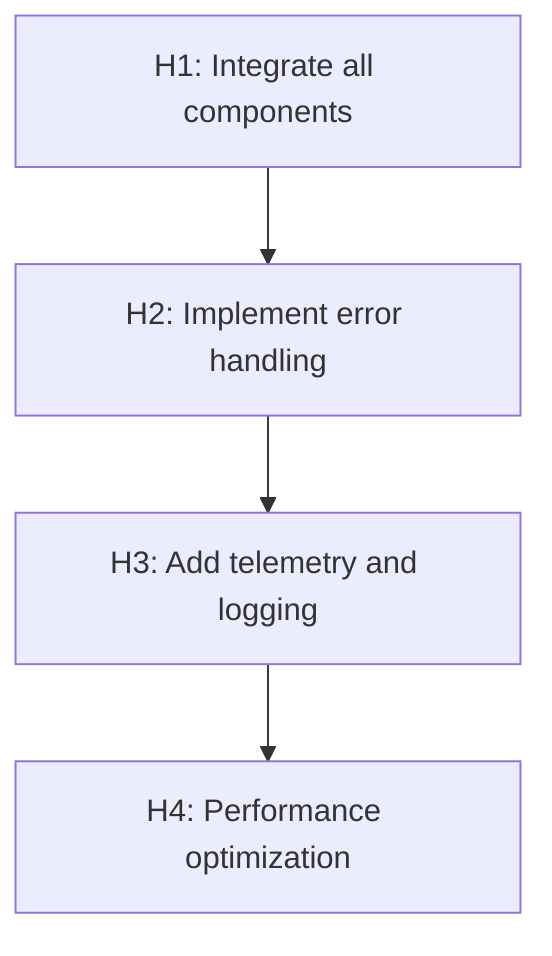
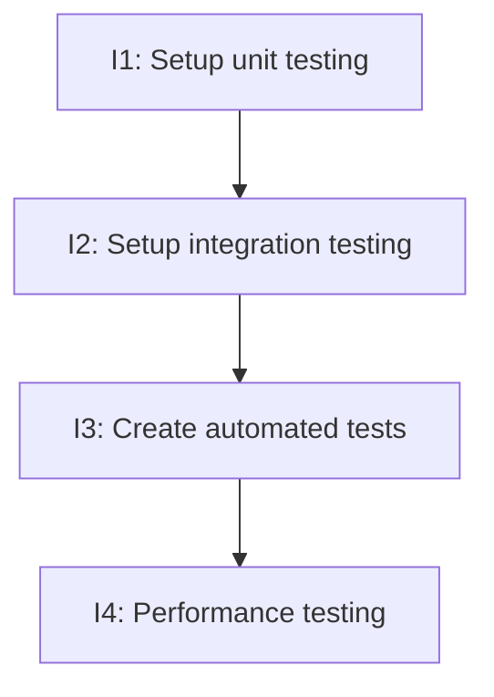
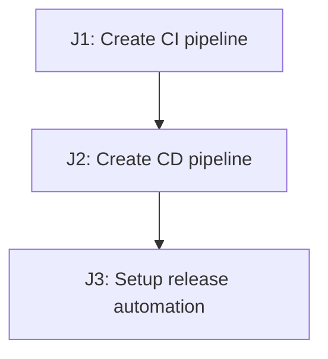
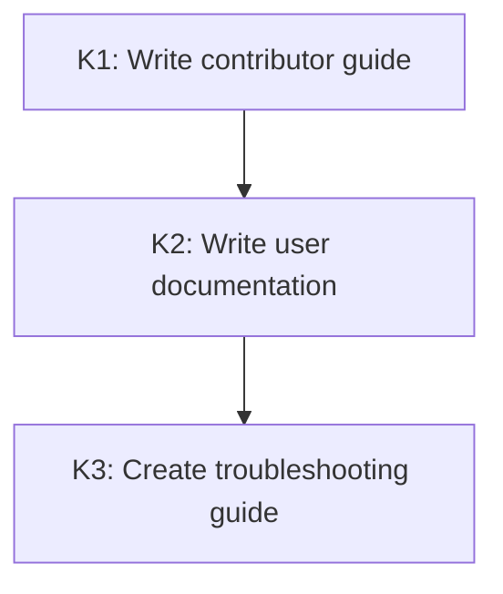

# Task Dependency Graph & Execution Plan

## Overview

This document defines the complete task breakdown for transforming udroid into a standalone Android app, with explicit dependency tracking and parallelization opportunities.

---

## Legend

- **[A/B/C/D]**: Phase identifier
- **→**: Depends on (must complete before starting)
- **⏡**: Can run in parallel with
- **🔄**: Sync point (all agents must coordinate)
- **🔒**: Blocking task (prevents downstream work)
- **✅**: Ready to start (no dependencies)

---

## Phase 1: Foundation (Parallelizable Streams)

### Stream A: Requirements & Architecture
**Agent:** Requirements & Architecture Agent
**Dependencies:** None



**Tasks:**

#### ✅ A1: Analyze udroid/Termux Architecture
- [ ] Document existing udroid components
- [ ] Map Termux paths to Android equivalents
- [ ] Identify PRoot dependencies and requirements
- [ ] Catalog proot-distro scripts and their functions
- [ ] Document VNC setup process in current system
- [ ] **Deliverable:** Migration analysis document
- [ ] **Estimate:** 2-3 days
- [ ] **Dependencies:** None

#### A2: Define Product Requirements
- [ ] Define target user personas (developers, enthusiasts, casual users)
- [ ] Document functional requirements (sessions, distros, desktop environments)
- [ ] Specify non-functional requirements (performance, storage, compatibility)
- [ ] Define device compatibility matrix (Android version, RAM, storage)
- [ ] Specify offline/online behavior scenarios
- [ ] **Deliverable:** Product Requirements Document (PRD)
- [ ] **Estimate:** 3-4 days
- [ ] **Dependencies:** A1

#### A3: Design High-Level System Architecture
- [ ] Create component diagram (Android layers, native layer, PRoot, filesystem)
- [ ] Define data flow diagrams (session start, input, display, shutdown)
- [ ] Specify security boundaries and isolation
- [ ] Define process model (services, native processes, threads)
- [ ] **Deliverable:** System architecture diagrams
- [ ] **Estimate:** 4-5 days
- [ ] **Dependencies:** A2

#### A4: Define Interface Contracts
- [ ] Specify `UbuntuSessionManager` public API (Kotlin interfaces)
- [ ] Define `UbuntuSession` lifecycle contract
- [ ] Document JNI bridge signatures for native layer
- [ ] Define configuration file formats (JSON, properties)
- [ ] Define rootfs directory structure specification
- [ ] **Deliverable:** Interface specification document
- [ ] **Estimate:** 3-4 days
- [ ] **Dependencies:** A3

#### 🔄 A5: Choose Display Strategy
- [ ] **DECISION:** VNC bridge vs. Wayland vs. XServer
- [ ] Evaluate tradeoffs: performance, complexity, compatibility
- [ ] Create proof-of-concept for chosen approach
- [ ] Document decision rationale
- [ ] **Deliverable:** Technology decision record + PoC
- [ ] **Estimate:** 3-5 days (includes PoC)
- [ ] **Dependencies:** A4

#### 🔄 A6: Choose Rootfs Distribution Model
- [ ] **DECISION:** Bundled vs. on-demand download vs. hybrid
- [ ] Define APK split strategy (by architecture, by distro)
- [ ] Specify update mechanism (full, delta, A/B)
- [ ] Define compression format and optimization
- [ ] **Deliverable:** Distribution strategy document
- [ ] **Estimate:** 2-3 days
- [ ] **Dependencies:** A4

---

### Stream B: Android App Shell Setup
**Agent:** Android App Shell Agent
**Dependencies:** A4 (interface contracts)

```mermaid
graph TD
    B1[B1: Create Android project scaffold] --> B2[B2: Configure Gradle build system]
    B2 --> B3[B3: Implement MainActivity]
    B3 --> B4[B4: Implement SetupWizardScreen (Compose)]
    B4 --> B5[B5: Implement SessionListScreen (Compose)]
    B5 --> B6[B6: Implement Desktop UI (DesktopActivity + DesktopScreen placeholder)]
    B6 --> B7[B7: Settings (future)]
    B5 --> B8[B8: Create ViewModels]
```

**Tasks:**

#### B1: Create Android Project Scaffold
- [ ] Initialize Android project with Kotlin
- [ ] Setup Gradle wrapper and version
- [ ] Configure AndroidManifest with permissions
- [ ] Setup application class
- [ ] Configure dependency injection (Hilt)
- [ ] **Deliverable:** Compilable Android project scaffold
- [ ] **Estimate:** 1-2 days
- [ ] **Dependencies:** A4 (for interface definitions)
- [ ] **Parallel with:** A5, A6 (if A4 complete)

#### B2: Configure Gradle Build System
- [ ] Setup build variants (debug, release, staging)
- [ ] Configure APK splits (by architecture)
- [ ] Setup native library packaging
- [ ] Configure ProGuard/R8
- [ ] Setup signing configuration
- [ ] **Deliverable:** Complete `build.gradle` files
- [ ] **Estimate:** 2-3 days
- [ ] **Dependencies:** B1, A6

#### B3: Implement MainActivity
- [ ] Implement permission request flow
- [ ] Check for first-run vs. returning user
- [ ] Navigate to SetupWizard or SessionList
- [ ] Initialize dependency injection
- [ ] **Deliverable:** MainActivity.kt
- [ ] **Estimate:** 2-3 days
- [ ] **Dependencies:** B2

#### B4: Implement SetupWizardScreen (Compose)
- [ ] Implement distro selection
- [ ] Implement session naming
- [ ] Wire create session action via `UbuntuSessionManager.createSession(config)`
- [ ] **Deliverable:** `SetupWizardScreen.kt` + `SetupWizardViewModel.kt`
- [ ] **Estimate:** 4-5 days
- [ ] **Dependencies:** B3, E1 (download service stub)
- [ ] **Parallel with:** B5 (if E1 ready)

#### B5: Implement SessionListScreen (Compose)
- [ ] List sessions from `UbuntuSessionManager.listSessions()`
- [ ] Start/stop/delete actions via Result-based APIs
- [ ] **Deliverable:** `SessionListScreen.kt` + `SessionListViewModel.kt`
- [ ] **Estimate:** 3-4 days
- [ ] **Dependencies:** B3
- [ ] **Parallel with:** B4

#### B6: Implement Desktop UI
- [ ] DesktopActivity wrapper to host Compose desktop UI
- [ ] DesktopScreen placeholder surface and stop control
- [ ] **Deliverable:** `ui/desktop/DesktopActivity.kt` + `ui/desktop/DesktopScreen.kt`
- [ ] **Estimate:** 2-3 days
- [ ] **Dependencies:** B5

#### B7: Settings (Future)
- [ ] Define settings scope and persistence model
- [ ] Add screen/route if/when needed
- [ ] **Estimate:** 3-4 days
- [ ] **Dependencies:** B6

#### B8: Create ViewModels
- [ ] Implement SessionListViewModel
- [ ] Implement SetupWizardViewModel
- [ ] Implement DesktopViewModel (stub for now)
- [ ] **Deliverable:** ViewModel classes
- [ ] **Estimate:** 2-3 days
- [ ] **Dependencies:** B5

---

### Stream C: Native Build Infrastructure
**Agent:** Developer Experience & Automation Agent
**Dependencies:** None (can start in parallel)



**Tasks:**

#### ✅ C1: Setup NDK and CMake
- [ ] Download and configure Android NDK
- [ ] Setup CMake for native builds
- [ ] Configure toolchain for arm64-v8a, armeabi-v7a, x86_64
- [ ] Test basic native compilation
- [ ] **Deliverable:** CMake toolchain configuration
- [ ] **Estimate:** 1-2 days
- [ ] **Dependencies:** None

#### C2: Create PRoot Build Configuration
- [ ] Configure CMake for PRoot compilation
- [ ] Setup Android-specific patches for PRoot
- [ ] Configure build for all target architectures
- [ ] **Deliverable:** CMakeLists.txt for PRoot
- [ ] **Estimate:** 3-4 days
- [ ] **Dependencies:** C1
- [ ] **Parallel with:** A2-A6, B1-B2

#### C3: Create VNC Bridge Build Configuration
- [ ] Setup CMake for VNC client library
- [ ] Configure native Android graphics integration
- [ ] **Deliverable:** CMakeLists.txt for VNC bridge
- [ ] **Estimate:** 2-3 days
- [ ] **Dependencies:** C1, A5 (display strategy decision)
- [ ] **Parallel with:** C2

#### C4: Setup Native Library Packaging
- [ ] Configure Gradle to bundle .so files
- [ ] Setup jniLibs directory structure
- [ ] Configure ABIs (arm64-v8a, armeabi-v7a, x86_64)
- [ ] **Deliverable:** Gradle configuration for native libs
- [ ] **Estimate:** 1-2 days
- [ ] **Dependencies:** C2, C3

#### C5: Create Build Scripts
- [ ] Create `build-native.sh` script
- [ ] Create `build-apk.sh` script
- [ ] Create `clean.sh` script
- [ ] **Deliverable:** Build automation scripts
- [ ] **Estimate:** 1-2 days
- [ ] **Dependencies:** C4

---

### Stream D: Rootfs Management
**Agent:** Packaging, Storage & Updates Agent
**Dependencies:** A4 (rootfs layout), A6 (distribution model)



**Tasks:**

#### D1: Design Storage Layout
- [ ] Define rootfs directory structure in app files dir
- [ ] Define session directory layout
- [ ] Define cache directory structure
- [ ] Specify file naming conventions
- [ ] **Deliverable:** Storage layout specification
- [ ] **Estimate:** 1-2 days
- [ ] **Dependencies:** A4, A6

#### D2: Implement Download Service
- [ ] Implement RootfsDownloadService (Kotlin)
- [ ] Add pause/resume support
- [ ] Add progress reporting callbacks
- [ ] Integrate with WorkManager for background downloads
- [ ] **Deliverable:** RootfsDownloadService.kt
- [ ] **Estimate:** 4-5 days
- [ ] **Dependencies:** D1

#### D3: Implement Verification Logic
- [ ] Implement SHA256 checksum verification
- [ ] Add file integrity checks
- [ ] Implement GPG signature verification (optional)
- [ ] **Deliverable:** Verification utilities
- [ ] **Estimate:** 2-3 days
- [ ] **Dependencies:** D2

#### D4: Implement Extraction Logic
- [ ] Implement tar.gz extraction
- [ ] Add progress reporting
- [ ] Implement atomic extraction (temp → final)
- [ ] Handle disk space checks
- [ ] **Deliverable:** Extraction utilities
- [ ] **Estimate:** 3-4 days
- [ ] **Dependencies:** D3

#### D5: Implement Storage Manager
- [ ] Implement storage usage calculation
- [ ] Implement cache cleanup
- [ ] Implement rootfs listing and deletion
- [ ] **Deliverable:** StorageManager.kt
- [ ] **Estimate:** 2-3 days
- [ ] **Dependencies:** D4

---

### Stream E: Service Layer
**Agent:** Android App Shell Agent
**Dependencies:** B2 (Gradle setup), A4 (interface contracts)



**Tasks:**

#### E1: Implement UbuntuSessionService
- [ ] Create foreground service
- [ ] Implement session lifecycle management
- [ ] Setup notification channel
- [ ] Create binder interface for UI communication
- [ ] **Deliverable:** UbuntuSessionService.kt
- [ ] **Estimate:** 4-5 days
- [ ] **Dependencies:** B2, A4

#### E2: Implement Notification System
- [ ] Create notification channels
- [ ] Implement session status notifications
- [ ] Add download progress notifications
- [ ] Implement error notification handling
- [ ] **Deliverable:** NotificationHelper.kt
- [ ] **Estimate:** 2-3 days
- [ ] **Dependencies:** E1

#### E3: Create Session Persistence Layer
- [ ] Implement session metadata storage (SharedPreferences/Room)
- [ ] Create session configuration serialization
- [ ] Implement session state persistence
- [ ] **Deliverable:** SessionRepository.kt
- [ ] **Estimate:** 2-3 days
- [ ] **Dependencies:** E2

---

## Phase 2: Core Integration (Critical Path)

### Stream F: PRoot Integration
**Agent:** Linux/PRoot Integration Agent
**Dependencies:** C2 (PRoot build), A4 (interfaces), D1 (storage layout)



**Tasks:**

#### 🔒 F1: Port PRoot to Android
- [ ] Cross-compile PRoot for Android
- [ ] Apply Android-specific patches (seccomp, namespaces)
- [ ] Test PRoot functionality in Android environment
- [ ] Package as native library
- [ ] **Deliverable:** Compiled PRoot binaries (arm64-v8a, armeabi-v7a, x86_64)
- [ ] **Estimate:** 5-7 days
- [ ] **Dependencies:** C2, D1
- [ ] **Blocker:** Must complete before F2

#### 🔒 F2: Adapt proot-distro Scripts
- [ ] Modify proot-distro for Android paths
- [ ] Adapt installation scripts for app directories
- [ ] Test script execution via JNI
- [ ] **Deliverable:** Modified proot-distro scripts
- [ ] **Estimate:** 4-5 days
- [ ] **Dependencies:** F1

#### 🔒 F3: Implement JNI Bridge
- [ ] Create JNI functions for process launching
- [ ] Implement stdio redirection
- [ ] Implement signal handling
- [ ] Add exit code propagation
- [ ] **Deliverable:** JNI bridge implementation
- [ ] **Estimate:** 4-5 days
- [ ] **Dependencies:** F2

#### 🔒 F4: Implement Session Launcher
- [ ] Implement UbuntuSessionManager (Kotlin + JNI)
- [ ] Build PRoot command line generator
- [ ] Implement environment setup
- [ ] Implement session startup/shutdown
- [ ] **Deliverable:** UbuntuSessionManager.kt
- [ ] **Estimate:** 5-6 days
- [ ] **Dependencies:** F3, E3

---

## Phase 3: Display & Input (After F4)

### Stream G: GUI Implementation
**Agent:** GUI & Interaction Agent
**Dependencies:** A5 (display strategy), F4 (session launcher), B6 (DesktopActivity)



**Tasks:**

#### G1: Implement VNC Client
- [ ] Implement RFB protocol (native or Java)
- [ ] Add connection management
- [ ] Implement framebuffer decoding
- [ ] Add input event transmission
- [ ] **Deliverable:** VNC client library
- [ ] **Estimate:** 6-8 days
- [ ] **Dependencies:** A5, C3 (VNC bridge build)

#### 🔒 G2: Implement DesktopSurfaceView
- [ ] Create SurfaceView subclass for rendering
- [ ] Implement OpenGL renderer (optional)
- [ ] Add touch event handling
- [ ] Add keyboard event handling
- [ ] **Deliverable:** DesktopSurfaceView.kt
- [ ] **Estimate:** 5-6 days
- [ ] **Dependencies:** G1, B6

#### G3: Implement Input Translation
- [ ] Implement touch → pointer translation
- [ ] Implement gesture recognition (pinch, swipe, long-press)
- [ ] Implement keyboard → keysym translation
- [ ] Add IME integration
- [ ] **Deliverable:** InputHandler.kt
- [ ] **Estimate:** 5-6 days
- [ ] **Dependencies:** G2

#### G4: Implement VncBridgeService
- [ ] Create service for VNC client lifecycle
- [ ] Implement connection to Ubuntu VNC server
- [ ] Add framebuffer callback to SurfaceView
- [ ] Implement input event forwarding
- [ ] **Deliverable:** VncBridgeService.kt
- [ ] **Estimate:** 4-5 days
- [ ] **Dependencies:** G3, F4

---

## Phase 4: Integration & Polish

### Stream H: End-to-End Integration
**Agent:** All agents
**Dependencies:** All previous streams



**Tasks:**

#### H1: Integrate All Components
- [ ] Connect UI to session manager
- [ ] Connect session manager to VNC bridge
- [ ] Connect download service to UI
- [ ] Test full user flows
- [ ] **Deliverable:** Working end-to-end prototype
- [ ] **Estimate:** 5-7 days
- [ ] **Dependencies:** G4, F4, D5, B8

#### H2: Implement Error Handling
- [ ] Add graceful error handling throughout
- [ ] Implement user-friendly error messages
- [ ] Add error recovery mechanisms
- [ ] Implement crash reporting
- [ ] **Deliverable:** Error handling framework
- [ ] **Estimate:** 4-5 days
- [ ] **Dependencies:** H1

#### H3: Add Telemetry and Logging
- [ ] Implement structured logging
- [ ] Add performance monitoring
- [ ] Add crash analytics
- [ ] Implement user feedback collection
- [ ] **Deliverable:** Logging framework
- [ ] **Estimate:** 3-4 days
- [ ] **Dependencies:** H2

#### H4: Performance Optimization
- [ ] Optimize VNC frame rate
- [ ] Reduce input latency
- [ ] Optimize memory usage
- [ ] Optimize battery usage
- [ ] **Deliverable:** Performance improvements
- [ ] **Estimate:** 5-7 days
- [ ] **Dependencies:** H3

---

### Stream I: Testing & QA
**Agent:** Developer Experience & Automation Agent
**Dependencies:** H1 (end-to-end integration)



**Tasks:**

#### I1: Setup Unit Testing
- [ ] Configure JUnit and MockK
- [ ] Setup test structure
- [ ] Create test utilities
- [ ] **Deliverable:** Unit test framework
- [ ] **Estimate:** 2-3 days
- [ ] **Dependencies:** None (can start in Phase 1)

#### I2: Setup Integration Testing
- [ ] Configure AndroidX Test
- [ ] Setup Espresso for UI tests
- [ ] Create mock native library
- [ ] **Deliverable:** Integration test framework
- [ ] **Estimate:** 3-4 days
- [ ] **Dependencies:** I1

#### I3: Create Automated Tests
- [ ] Write unit tests for ViewModels
- [ ] Write unit tests for services
- [ ] Write integration tests for user flows
- [ ] **Deliverable:** Test suite
- [ ] **Estimate:** 7-10 days
- [ ] **Dependencies:** I2, H1

#### I4: Performance Testing
- [ ] Create performance benchmarks
- [ ] Setup automated performance regression tests
- [ ] Create load tests for VNC
- [ ] **Deliverable:** Performance test suite
- [ ] **Estimate:** 4-5 days
- [ ] **Dependencies:** H4

---

### Stream J: CI/CD & Release
**Agent:** Developer Experience & Automation Agent
**Dependencies:** C5 (build scripts), I3 (tests)



**Tasks:**

#### J1: Create CI Pipeline
- [ ] Configure GitHub Actions
- [ ] Setup automated builds
- [ ] Setup automated testing
- [ ] **Deliverable:** CI workflow
- [ ] **Estimate:** 3-4 days
- [ ] **Dependencies:** C5, I1

#### J2: Create CD Pipeline
- [ ] Configure automated releases
- [ ] Setup APK signing
- [ ] Configure GitHub release creation
- [ ] **Deliverable:** CD workflow
- [ ] **Estimate:** 3-4 days
- [ ] **Dependencies:** J1, I3

#### J3: Setup Release Automation
- [ ] Create version bump script
- [ ] Create changelog generator
- [ ] Automate GitHub release notes
- [ ] **Deliverable:** Release automation scripts
- [ ] **Estimate:** 2-3 days
- [ ] **Dependencies:** J2

---

### Stream K: Documentation
**Agent:** Developer Experience & Automation Agent
**Dependencies:** All implementation streams



**Tasks:**

#### K1: Write Contributor Guide
- [ ] Document development setup
- [ ] Document build process
- [ ] Document code structure
- [ ] Document contribution workflow
- [ ] **Deliverable:** CONTRIBUTING.md
- [ ] **Estimate:** 3-4 days
- [ ] **Dependencies:** C5, J1

#### K2: Write User Documentation
- [ ] Write installation guide
- [ ] Write getting started guide
- [ ] Document features
- [ ] Create FAQ
- [ ] **Deliverable:** User documentation
- [ ] **Estimate:** 4-5 days
- [ ] **Dependencies:** H4

#### K3: Create Troubleshooting Guide
- [ ] Document common issues
- [ ] Document error messages
- [ ] Create debugging guide
- [ ] **Deliverable:** Troubleshooting guide
- [ ] **Estimate:** 2-3 days
- [ ] **Dependencies:** K2

---

## Parallelization Matrix

### Phase 1 (Maximum Parallelism)
| Task | Dependencies | Can Parallel With |
|------|--------------|-------------------|
| A1-A4 | Sequential | B1, C1-C2, D1, E1 |
| A5 | A4 | B1-B3, C1-C3, D1-D2, E1 |
| A6 | A4 | B1-B3, C1-C3, D1-D2, E1 |
| B1-B2 | A4 | A5-A6, C1-C3, D1, E1 |
| B3 | B2 | A5-A6, C1-C3, D1-D2, E1-E2 |
| B4-B5 | B3 | A5-A6, C1-C3, D1-D2, E1-E2 |
| C1-C5 | Sequential | A1-A6, B1-B3, D1-D2, E1-E2 |
| D1-D5 | Sequential | A1-A6, B1-B3, C1-C5, E1-E2 |
| E1-E3 | Sequential | A1-A6, B1-B3, C1-C5, D1-D5 |

**Maximum Parallel Streams in Phase 1:** 6 (A, B, C, D, E, I)

### Phase 2 (Sequential Blocking)
| Task | Dependencies | Can Parallel With |
|------|--------------|-------------------|
| F1 | C2, D1 | B4-B5, E1-E2, I1 |
| F2 | F1 | B4-B8, E1-E3, I1-I2 |
| F3 | F2 | B4-B8, E1-E3, I1-I2 |
| F4 | F3, E3 | B4-B8, I1-I2 |

**Critical Path:** C2 → F1 → F2 → F3 → F4

### Phase 3 (After F4)
| Task | Dependencies | Can Parallel With |
|------|--------------|-------------------|
| G1 | A5, C3 | I1-I2 |
| G2 | G1, B6 | I1-I2 |
| G3 | G2 | I1-I2 |
| G4 | G3, F4 | I1-I2 |

**Critical Path:** F4 → G1 → G2 → G3 → G4

### Phase 4 (Integration)
| Task | Dependencies | Can Parallel With |
|------|--------------|-------------------|
| H1 | G4, F4, D5, B8 | I1-I2, J1, K1 |
| H2 | H1 | I2-I3, J1, K1 |
| H3 | H2 | I3, J1-J2, K1 |
| H4 | H3 | I3-I4, J1-J2, K1-K2 |
| I1-I4 | Sequential/Parallel | H1-H4, J1-J2, K1-K3 |
| J1-J3 | Sequential | H1-H4, I1-I4, K1-K3 |
| K1-K3 | Sequential | H1-H4, I1-I4, J1-J3 |

**Maximum Parallel Streams in Phase 4:** 3 (H/I/J, I, K)

---

## Sync Points & Coordination

### 🔄 Sync Point 1: Interface Lock-in
**When:** After A4 complete, before B1, C2, D1, F1
**Agents:** All agents
**Decision:** Finalize all interface contracts
**Blocks:** Android implementation, native integration, storage

**Agenda:**
1. Review `UbuntuSessionManager` API
2. Review rootfs directory structure
3. Review JNI interface signatures
4. Review configuration file formats

### 🔄 Sync Point 2: Display Strategy
**When:** After A5 complete, before C3, G1
**Agents:** Requirements & Architecture, GUI, Linux/PRoot
**Decision:** VNC vs. Wayland vs. XServer

**Agenda:**
1. Review PoC results
2. Make final decision
3. Update architecture document
4. Communicate to all agents

### 🔄 Sync Point 3: Rootfs Distribution
**When:** After A6 complete, before B2, D1
**Agents:** Requirements & Architecture, Packaging, Android App Shell
**Decision:** Bundled vs. on-demand vs. hybrid

**Agenda:**
1. Review distribution strategy
2. Define APK split approach
3. Define update mechanism
4. Update architecture document

### 🔄 Sync Point 4: Session API Finalization
**When:** After F4 complete, before G4, H1
**Agents:** Linux/PRoot, Android App Shell, GUI
**Decision:** Final session lifecycle API

**Agenda:**
1. Review session manager implementation
2. Verify interface contract compliance
3. Test integration points
4. Freeze session API for v1.0

### 🔄 Sync Point 5: Feature Freeze
**When:** Before H4
**Agents:** All agents
**Decision:** No new features, only polish and bug fixes

**Agenda:**
1. Review all implemented features
2. Identify and prioritize bugs
3. Define v1.0 scope
4. Create release blockers list

---

## Timeline Estimate

### Optimistic Scenario (Full Parallelization)
- **Phase 1:** 3-4 weeks (6 parallel streams)
- **Phase 2:** 3-4 weeks (sequential critical path)
- **Phase 3:** 4-5 weeks (display and input)
- **Phase 4:** 3-4 weeks (integration and polish)
- **Total:** ~13-17 weeks (~3-4 months)

### Realistic Scenario (Partial Parallelization)
- **Phase 1:** 4-5 weeks
- **Phase 2:** 4-5 weeks
- **Phase 3:** 5-6 weeks
- **Phase 4:** 4-5 weeks
- **Total:** ~17-21 weeks (~4-5 months)

### Conservative Scenario (Sequential Dependencies)
- **Phase 1:** 5-6 weeks
- **Phase 2:** 5-6 weeks
- **Phase 3:** 6-7 weeks
- **Phase 4:** 5-6 weeks
- **Total:** ~21-25 weeks (~5-6 months)

---

## Risk Assessment

### High Risk Items
1. **PRoot on Android** (F1) - Unknown compatibility issues
   - **Mitigation:** Create PoC early in Phase 1
   - **Fallback:** Investigate alternative chroot mechanisms

2. **VNC Performance** (G1-G2) - May not meet 30 FPS target
   - **Mitigation:** Early performance benchmarks
   - **Fallback:** Investigate Wayland or XServer direct rendering

3. **Storage Constraints** (D1-D5) - Users may lack storage
   - **Mitigation:** Hybrid distribution model (minimal base + download)
   - **Fallback:** External storage support

### Medium Risk Items
1. **Native Build Complexity** (C2-C5) - Cross-compilation issues
   - **Mitigation:** Early setup of build infrastructure

2. **Input Latency** (G3) - Touch-to-display lag
   - **Mitigation:** Optimize VNC client, consider hardware acceleration

3. **Session Startup Time** (F4) - May be slow
   - **Mitigation:** Progress indicators, caching optimizations

---

## Next Actions

### Immediate (This Week)
1. **Kick off Phase 1:**
   - Start A1 (analyze existing udroid) - Requirements Agent
   - Start C1 (setup NDK) - DX Agent
   - Start I1 (setup unit tests) - DX Agent

2. **Schedule Sync Point 1:**
   - Book meeting for when A4 is complete
   - Invite all agents

3. **Create project tracking:**
   - Setup GitHub projects/boards
   - Create milestones for each phase
   - Assign tasks to agents

### Short-term (Next 2-3 Weeks)
1. Complete Phase 1 parallel streams
2. Conduct Sync Point 1
3. Begin Phase 2 (PRoot integration)

### Medium-term (Next 1-2 Months)
1. Complete Phase 2 (critical path)
2. Conduct Sync Points 2 & 3
3. Begin Phase 3 (display and input)

---

## Task Tracking Template

Each agent should track their tasks using this template:

```markdown
## [Agent Name] Task Progress

### Current Sprint
- [ ] Task ID - Task Name (Status: In Progress/Blocked/Done)
  - Dependencies: [Task IDs]
  - Estimated: X days
  - Actual: X days
  - Blockers: [If any]

### Completed This Sprint
- [x] Task ID - Task Name
  - Completed: [Date]
  - Notes: [Any issues or learnings]

### Upcoming (Ready to Start)
- [ ] Task ID - Task Name
  - Dependencies: [Satisfied/Waiting for X]
  - Estimated: X days

### Risks & Issues
- [ ] Risk/Issue description
  - Impact: High/Medium/Low
  - Mitigation: [Plan]
  - Status: Active/Resolved
```
